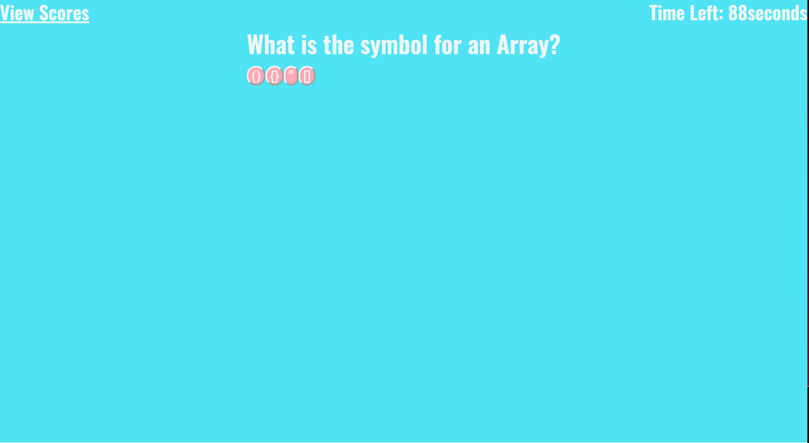

# stunning-system

## Description

This is a quiz about JavaScript consisting of 5 multiple choice questions. This is a timed quiz, however, you have 100 seconds to get through it. During this quiz you'll get rewarded for correct answers by receiving 40pts, and you'll lose 25 seconds for incorrect answers. You will notice that if you answer correctly it will show up in green, and if you answer incorrectly it will show up in red, but it will display the correct answer in the top right corner. From this quiz I learned how to create a user friendly quiz application by using the knowledge that I have gained from JavaScript, CSS, and HTML. I built this project with the hopes that it will better prepare me for possible scenarios of interviews that may come down the road. 

## Usage

           

## Website Link

 https://dossj88.github.io/stunning-system/

